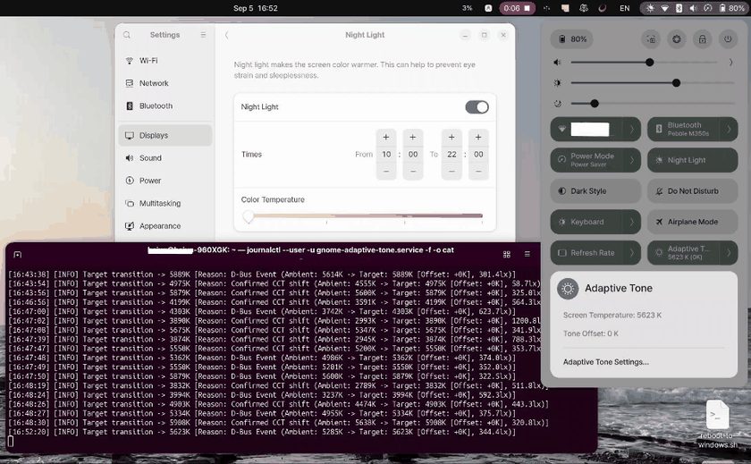

[English](README.md) | **[한국어](README.ko.md)**

# GNOME Adaptive Tone v3.2 for Linux

> **Hardware-based Ambient Color Temperature (CCT) Matching for GNOME / Ubuntu**  
> 주변 조명에 맞춰 디스플레이 색온도를 실시간 보정하는 데몬 & **GNOME Shell Extension (GUI 환경설정 탑재)** 입니다.

---

## 1. 개요 (Overview)

랩탑에 내장된 하드웨어 조도/색온도 센서(ALS/CCT)의 실제 켈빈(Kelvin) 값을 실시간으로 읽어, 디스플레이의 화이트 포인트를 주변광에 맞게 실시간 조절해 줍니다.

**네이티브 GNOME Shell Extension**과 **Libadwaita 기반 환경설정 GUI**를 제공합니다. 빠른 설정(Quick Settings) 및 상단 패널 인디케이터에서 실시간 상태 확인 및 원클릭 ON/OFF가 가능하며, 모든 파라미터를 GUI에서 조절하고 즉시 기본값으로 되돌릴 수 있습니다.

> **작동 원리 및 제어 방식:**  
> 본 프로그램은 GNOME의 네이티브 **야간 모드(Night Light) 색온도 슬라이더 파이프라인(`night-light-temperature`)**을 제어합니다.  
> 특수 유색 조명(녹색, 붉은색 등)에 맞춘 임의 RGB 컬러 매트릭스 보정이 아니라, 일상적인 조명 환경(따뜻한 전구색 2700K ~ 차가운 주광색 6500K)의 **흑체 궤적 켈빈(Kelvin) 색온도 축**을 따라 화면의 화이트 포인트를 조절합니다. 외부 감마 도구 없이 GNOME 자체 하드웨어 LUT 엔진을 활용하므로 Wayland/X11에서 시스템 충돌 없이 가볍고 부드럽게 작동합니다.

### 검증된 하드웨어 (Tested Hardware)
* **기기 모델:** **Samsung Galaxy Book4 Pro 16인치 (NT960XGK)**
* **센서 칩셋:** Intel Sensor Hub (ISH) ALS CCT (`HID-SENSOR-200041`, `als`)
* **센서 경로:** `/sys/bus/iio/devices/iio:device*/in_colortemp_raw`
* **운영체제 환경:** Ubuntu 24.04 / 26.04+ (GNOME 45~50+ Wayland 및 X11 지원)

---

## 2. GUI 환경설정 & GNOME Shell Extension

### 동작 시연 (Demonstration)

<p align="center">
  
</p>

### 스크린샷 (Screenshots)

<p align="center">
  
  &nbsp;&nbsp;&nbsp;&nbsp;
  
</p>

<p align="center">
  
  &nbsp;&nbsp;
  
</p>

### 주요 기능
1. **GNOME 빠른 설정(Quick Settings) 메뉴 통합:**
   - 우측 상단 빠른 설정 창에 **'Adaptive Tone' 전용 토글 타일** 추가.
   - 타일을 클릭하여 즉시 켜기/끄기(ON/OFF) 가능.
   - 타일 우측 화살표(`>`)를 누르면 서브메뉴에서 실시간 화면 색온도/오프셋 확인 및 'Adaptive Tone 설정...' 바로가기 제공.
   - (선택 사항) 상단 바 인디케이터 아이콘도 환경설정에서 켜고 끌 수 있음 (기본값: 빠른 설정 토글 타일만 표시).
2. **Libadwaita 모던 설정 창:**
   - **화면 및 색감:** 색온도 미세 오프셋(기본 0K), 최저/최고 화면 색온도 설정.
   - **센서 및 알고리즘:** 주변광 매핑 범위(기본 2500K~7000K), Hysteresis 변화 감도 역치(기본 100K).
   - **보호 및 절전:** 센서 가림 저조도 보호(기본 5.0 lx, 3.0s 홀드), 절전 복귀 지연(기본 2.0s 디바운스).
   - **폴링 설정:** 순수 이벤트 드리븐 vs 주기적 보조 폴링 토글.

---

## 3. 아키텍처 및 핵심 알고리즘 (Architecture)

```text
                  [ IIO ALS 하드웨어 센서 ]
                             │
            ┌────────────────┴────────────────┐
     Illuminance (Lux)                   CCT (Raw Kelvin)
     (Startup Caching)                   (Startup Caching)
            │                                 │
            └────────────────┬────────────────┘
                             ↓
              [ ① 스마트 저조도 / 가림 가드 ]
                (일시적 손 가림 <3.0s monotonic vs 실제 어두운 방 구분)
                             ↓
              [ ② Ambient → Display Transfer Function ]
                (SmoothStep 곡선으로 자연스러운 화이트포인트 100% 직결 매핑)
                             ↓
              [ ③ 미세 조정 오프셋 (기본: 0K) ]
                             ↓
              [ ④ Hysteresis (100K 임계값) ]
                (마지막 적용된 화면 색온도 대비 100K 이상 변화 시만 갱신)
                             ↓
              [ ⑤ 절전 모드 보호 (PrepareForSleep 2.0s 디바운스) ]
                             ↓
              [ ⑥ GNOME 자체 하드웨어 감마 LUT 엔진 ] (단 1회 GSettings 기록)
                             ↑
    [ GNOME Extension GUI / GSettings (org.gnome.shell.extensions.adaptivetone) ]
```

---

## 4. 설치 방법 (Installation)

```bash
git clone https://github.com/hajunlee213/gnome-adaptive-tone.git
cd gnome-adaptive-tone
chmod +x install.sh
./install.sh
```

---

## 5. 사용법 및 명령어 (Usage)

### 1. GUI 설정 창 열기
```bash
gnome-adaptive-tone --settings
# 또는 앱 그리드(Super 키)에서 'Adaptive Tone 설정' 검색 후 실행
# 또는 상단 패널 메뉴에서 'Adaptive Tone 설정...' 클릭
```

### 2. 현재 상태 및 센서 매핑 확인
```bash
gnome-adaptive-tone --status
```
*출력 예시:*
```text
=================================================
        GNOME Adaptive Tone Status v3.2.0        
=================================================
Sensor Device       : /sys/bus/iio/devices/iio:device0 (als)
Ambient Light Temp  : 4151.0 K
Ambient Light Lux   : 733.9 Lux
Calculated Target K : 4652 K  (Mapped from 4151K with +0K offset)
Transfer Curve      : Ambient [2500K-7000K] -> Display [3800K-6500K]
Fine-tune Offset    : +0 K
Update Threshold    : 100 K
Glitch Filter       : Step Δ≥500K (Hold 0.8s)
Fallback Polling    : Disabled (100% Pure Event-Driven)
Suspend Protection  : Enabled (PrepareForSleep, 2.0s debounce)
Occlusion Guard     : <5.0 lx for 3.0s
Current Screen K    : 4650 K
GNOME Night Light   : Enabled
Extension Master    : Active
=================================================
```

### 3. 화면 변경 없이 센서 계산값만 테스트 (Dry Run)
```bash
gnome-adaptive-tone --dry-run
```

### 4. 순정 GNOME 설정으로 복구
```bash
gnome-adaptive-tone --restore
```

### 5. 서비스 제어 (systemd)
* **서비스 재시작:** `systemctl --user restart gnome-adaptive-tone.service`
* **서비스 중지:** `systemctl --user stop gnome-adaptive-tone.service`
* **서비스 로그 확인:** `journalctl --user -u gnome-adaptive-tone.service -f`

---

## 6. 커스터마이징 파라미터 (Settings Reference)

| 파라미터 키 | GUI 명칭 | 기본값 | 추천 범위 | 단위/설명 |
| :--- | :--- | :--- | :--- | :--- |
| `temp-offset` | 색온도 미세 오프셋 | `0 K` | -1000 ~ +1000 K | +는 쿨톤(선명한 화이트), -는 웜톤(따뜻한 색) |
| `display-min` | 최저 화면 색온도 | `3800 K` | 2500 ~ 5000 K | 따뜻한 실내 조명 시 과도한 황변 방지 |
| `display-max` | 최고 화면 색온도 | `6500 K` | 5000 ~ 9000 K | 자연광 주광 상태의 표준 D65 화이트포인트 |
| `ambient-min` | 센서 최저 색온도 | `2500 K` | 1000 ~ 4000 K | SmoothStep S-Curve 최저 기준점 |
| `ambient-max` | 센서 최고 색온도 | `7000 K` | 5000 ~ 12000 K | SmoothStep S-Curve 최고 기준점 |
| `update-threshold` | 변화 감도 역치 | `100 K` | 10 ~ 400 K | 미세 조명 떨림 방지 Hysteresis 임계값 |
| `glitch-threshold` | 글리치 필터 역치 | `500 K` | 200 ~ 2000 K | 순간 튐으로 의심할 색온도 급변폭 |
| `glitch-confirm-sec` | 글리치 확인 대기 | `0.8 s` | 0.2 ~ 5.0 s | 대형 점프 감지 시 관찰 지속 시간 |
| `min-lux-threshold` | 가림 저조도 임계값 | `5.0 lx` | 0.5 ~ 30.0 lx | 일시적 센서 가림 시 오작동 방지 |
| `occlusion-hold-sec` | 센서 가림 유지 시간 | `3.0 s` | 0.5 ~ 10.0 s | 저조도 감지 시 현재 색온도 유지 시간 |
| `resume-delay-sec` | 절전 복귀 지연 | `2.0 s` | 0.5 ~ 5.0 s | 절전 복귀 시 센서/디스플레이 안정화 대기 |
| `enable-polling` | 보조 폴링 활성화 | `False` | On / Off | 순수 이벤트 모드(CPU 무부하) vs 폴링 병행 |
| `poll-interval` | 폴링 주기 | `10 s` | 1 ~ 60 s | 보조 폴링 타이머 간격 |

---

## 7. 제거 방법 (Uninstallation)

```bash
cd ~/projects/gnome-adaptive-tone
./uninstall.sh
```
