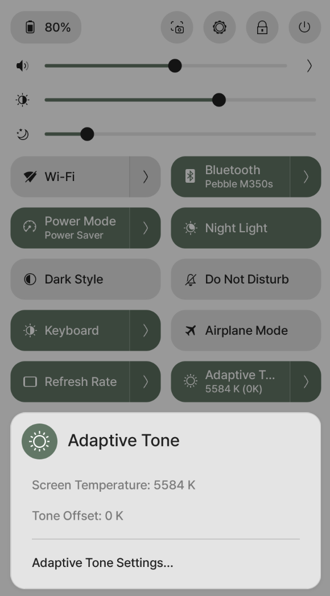
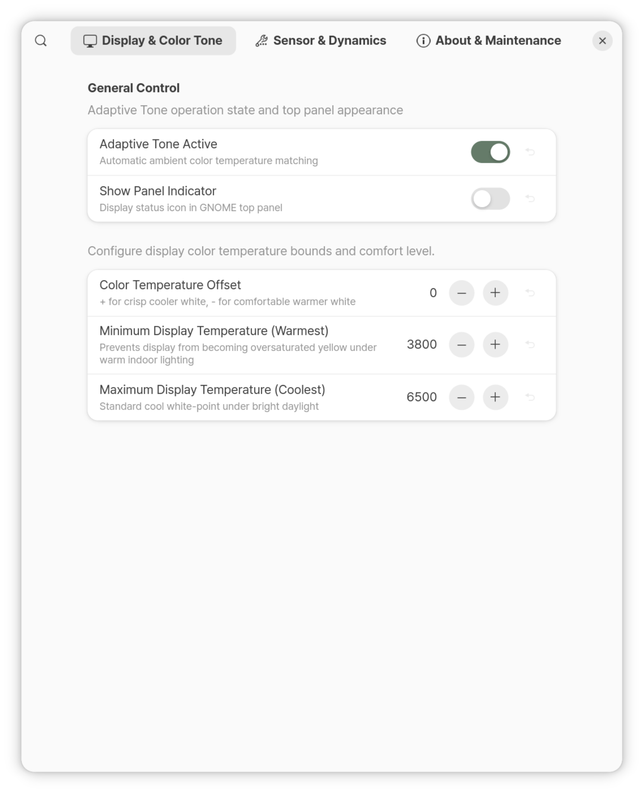
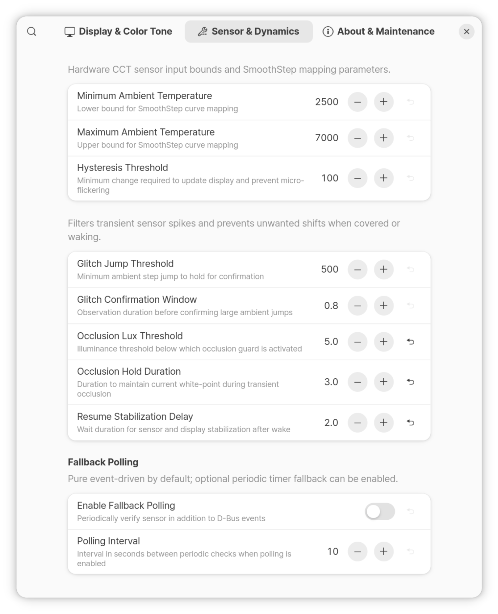
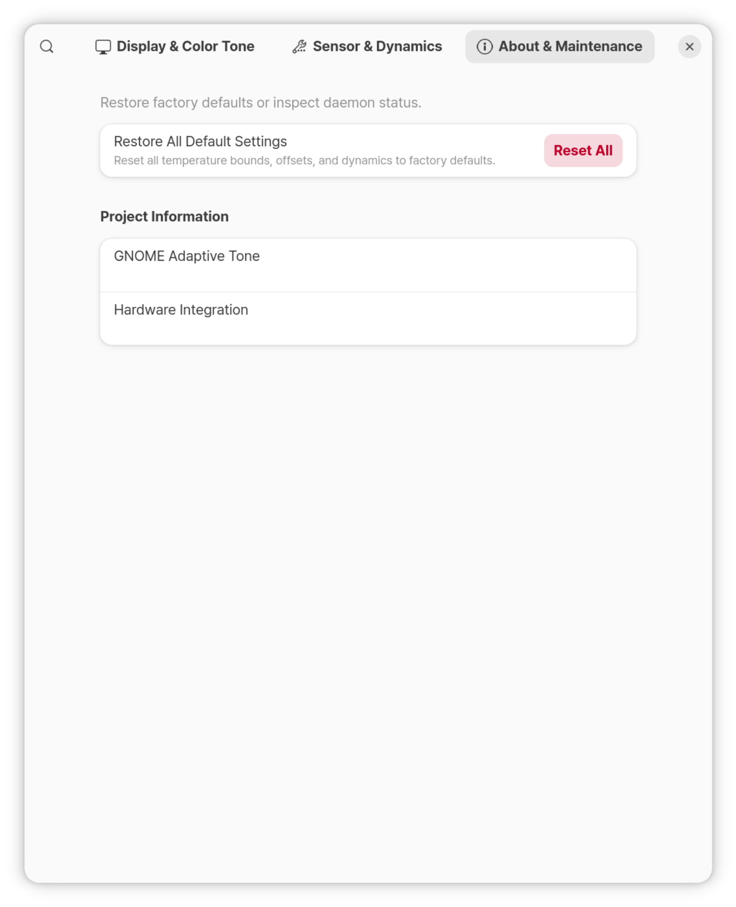

**[English](README.md)** | [한국어](README.ko.md)

# GNOME Adaptive Tone v3.2 for Linux

> **Hardware-based Ambient Color Temperature (CCT) Matching for GNOME / Ubuntu**  
> A lightweight daemon & **GNOME Shell Extension (with Libadwaita Preferences GUI)** that dynamically matches your display color temperature to surrounding ambient light in real time (similar to Apple True Tone or Windows Adaptive Color).

---

## 1. Overview

**GNOME Adaptive Tone** reads real-time correlated color temperature (Kelvin) from your laptop's built-in ambient light sensor (ALS/CCT) and continuously adapts the display's white point using a human chromatic adaptation model.

Equipped with a **native GNOME Shell Extension** and a modern **Libadwaita Preferences GUI**, it integrates directly into GNOME's Quick Settings menu and top panel for one-click toggling, real-time status monitoring, and granular calibration with instant reset buttons.

### Tested Hardware
* **Device Model:** **Samsung Galaxy Book4 Pro 16" (NT960XGK)**
* **Sensor Chipset:** Intel Sensor Hub (ISH) ALS CCT (`HID-SENSOR-200041`, `als`)
* **Sysfs Interface:** `/sys/bus/iio/devices/iio:device*/in_colortemp_raw`
* **Supported OS:** Ubuntu 24.04 / 26.04+ (GNOME 45~50+ on Wayland and X11)
* *Universal Compatibility: Works with any Linux laptop where the ambient color temperature sensor is exposed via the standard Linux IIO subsystem (`in_colortemp_raw`).*

---

## 2. GNOME Shell Extension & Preferences GUI

### Screenshots

<p align="center">
  
  &nbsp;&nbsp;&nbsp;&nbsp;
  
</p>

<p align="center">
  
  &nbsp;&nbsp;
  
</p>

### Key Features
1. **GNOME Quick Settings Integration:**
   * Adds a dedicated **'Adaptive Tone' toggle tile** in the top-right Quick Settings menu.
   * Click the tile to instantly toggle ON/OFF.
   * Expand the tile submenu (`>`) to view real-time color temperature, offset, and a shortcut to Preferences.
   * Optional top bar panel indicator icon (configurable in Preferences).
2. **Modern Libadwaita Preferences Dialog:**
   * **Display & Tone:** Fine-tuning offset (default: 0K), display minimum/maximum bounds (prevents extreme yellowing).
   * **Sensors & Curves:** Ambient input mapping range (default: 2500K-7000K), hysteresis sensitivity threshold (default: 100K).
   * **Safeguards & Power:** Occlusion guard (5.0 lx threshold with 3.0s hold to ignore brief hand shadows), suspend/resume debounce (2.0s delay to protect D-Bus stability).
   * **Zero Overhead:** 100% pure event-driven architecture listening to `iio-sensor-proxy` D-Bus events (0.00% CPU when lighting is stable).
3. **Instant Reset Buttons:**
   * Individual "Reset to Default" buttons for every single parameter.
   * Global "Restore All Defaults" button.
4. **Zero-Delay Synchronization:**
   * Parameter changes in the GUI immediately take effect via GSettings (`org.gnome.shell.extensions.adaptivetone`) with 0ms delay.

---

## 3. Architecture & Algorithm Pipeline

```text
                  [ IIO ALS Hardware Sensor ]
                              │
            ┌─────────────────┴─────────────────┐
     Illuminance (Lux)                     CCT (Raw Kelvin)
     (Startup Caching)                     (Startup Caching)
            │                                   │
            └─────────────────┬─────────────────┘
                              ↓
              [ 1. Smart Occlusion Guard ]
                 (Filters brief hand shadows <3.0s vs legitimate dark rooms)
                              ↓
              [ 2. Ambient → Display Transfer Function ]
                 (SmoothStep S-curve compression: 2500K-7000K -> 3800K-6500K)
                              ↓
              [ 3. Fine-Tuning Offset (Default: 0K) ]
                              ↓
              [ 4. Hysteresis Threshold (100K) ]
                 (Updates display LUT only when target shift >= 100K)
                              ↓
              [ 5. Suspend / Resume Safety ]
                 (Listens to systemd-logind PrepareForSleep with 2.0s debounce)
                              ↓
              [ 6. GNOME Native Gamma LUT Engine ]
                 (gsd-color / Mutter hardware interpolation via single GSettings write)
                              ↑
    [ GNOME Extension GUI / GSettings (org.gnome.shell.extensions.adaptivetone) ]
```

---

## 4. Installation

```bash
git clone https://github.com/hajunlee213/gnome-adaptive-tone.git
cd gnome-adaptive-tone
chmod +x install.sh
./install.sh
```

The installer will automatically:
1. Verify the presence of a hardware CCT sensor under `/sys/bus/iio/devices/`.
2. Compile and install GSettings schemas and Gettext translation files.
3. Install and start the systemd user service (`gnome-adaptive-tone.service`).
4. Enable and register the GNOME Shell Extension (`adaptivetone@hajun.github.io`).

---

## 5. Usage & CLI Commands

### 1. Open Settings GUI
```bash
gnome-adaptive-tone --settings
# Or launch "Adaptive Tone Settings" from your Application Grid (Super key)
# Or click "Adaptive Tone Settings..." from the GNOME top panel menu
```

### 2. Check Real-Time Sensor & Mapping Status
```bash
gnome-adaptive-tone --status
```
*Sample Output:*
```text
=================================================
        GNOME Adaptive Tone Status v3.2.0        
=================================================
Sensor Device       : /sys/bus/iio/devices/iio:device0 (als)
Ambient Light Temp  : 4151.0 K
Ambient Light Lux   : 733.9 Lux
Calculated Target K : 4652 K  (Mapped from 4151K with +0K offset)
Transfer Curve      : Ambient [2500K-7000K] -> Display [3800K-6500K]
Fine-tune Offset    : +0 K
Update Threshold    : 100 K
Glitch Filter       : Step Δ≥500K (Hold 0.8s)
Fallback Polling    : Disabled (100% Pure Event-Driven)
Suspend Protection  : Enabled (PrepareForSleep, 2.0s debounce)
Occlusion Guard     : <5.0 lx for 3.0s
Current Screen K    : 4650 K
GNOME Night Light   : Enabled
Extension Master    : Active
=================================================
```

### 3. Dry Run Test (Print calculations without altering display)
```bash
gnome-adaptive-tone --dry-run
```

### 4. Restore Default GNOME Night Light Settings
```bash
gnome-adaptive-tone --restore
```

### 5. Service Management (systemd)
* **Restart Service:** `systemctl --user restart gnome-adaptive-tone.service`
* **Stop Service:** `systemctl --user stop gnome-adaptive-tone.service`
* **View Live Logs:** `journalctl --user -u gnome-adaptive-tone.service -f`

---

## 6. Settings Reference

| Key | GUI Label | Default | Recommended Range | Description |
| :--- | :--- | :--- | :--- | :--- |
| `temp-offset` | Color Temperature Offset | `0 K` | -1000 ~ +1000 K | `+` for cooler/crisp white, `-` for warmer tones |
| `display-min` | Minimum Display Temp | `3800 K` | 2500 ~ 5000 K | Warmest display limit (prevents oversaturated yellow) |
| `display-max` | Maximum Display Temp | `6500 K` | 5000 ~ 9000 K | Coolest display limit (standard D65 daylight white) |
| `ambient-min` | Minimum Ambient Temp | `2500 K` | 1000 ~ 4000 K | Lower bound for SmoothStep transfer curve |
| `ambient-max` | Maximum Ambient Temp | `7000 K` | 5000 ~ 12000 K | Upper bound for SmoothStep transfer curve |
| `update-threshold` | Update Sensitivity | `100 K` | 10 ~ 400 K | Hysteresis threshold to avoid jitter under micro-flicker |
| `glitch-threshold` | Glitch Step Threshold | `500 K` | 200 ~ 2000 K | Step jump threshold triggering observation hold |
| `glitch-confirm-sec` | Glitch Confirm Window | `0.8 s` | 0.2 ~ 5.0 s | Observation duration before applying large ambient shifts |
| `min-lux-threshold` | Low Lux Guard Threshold | `5.0 lx` | 0.5 ~ 30.0 lx | Lux cutoff to differentiate hand shadows from ambient |
| `occlusion-hold-sec` | Occlusion Hold Duration | `3.0 s` | 0.5 ~ 10.0 s | Hold display temperature when sensor is blocked |
| `resume-delay-sec` | Resume Stabilization Delay | `2.0 s` | 0.5 ~ 5.0 s | Stabilization delay after waking from sleep |
| `enable-polling` | Fallback Polling | `False` | On / Off | Pure event-driven (0% CPU) vs periodic sensor polling |
| `poll-interval` | Polling Interval | `10 s` | 1 ~ 60 s | Fallback timer interval (when polling is enabled) |

---

## 7. Uninstallation

```bash
cd ~/projects/gnome-adaptive-tone
./uninstall.sh
```

---

## 8. License

Distributed under the [GNU General Public License v3.0 (GPL-3.0)](LICENSE).
